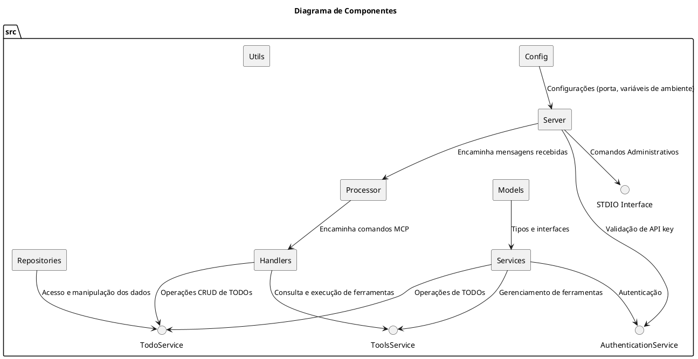
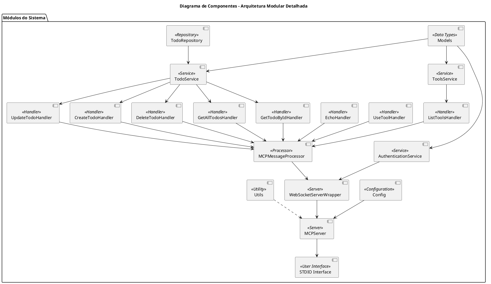
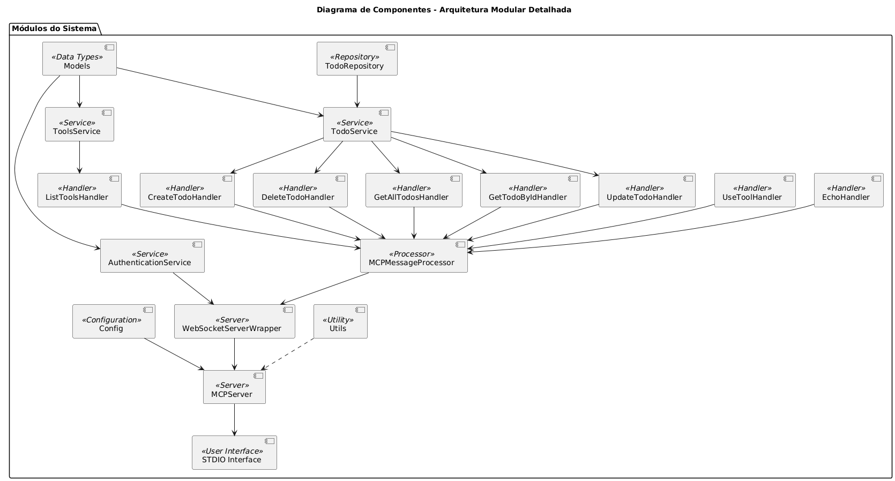

## 1. Diagrama de Componentes

Este diagrama geral destaca a separação de responsabilidades e as interações principais entre os módulos do sistema, considerando as novas pastas e arquivos.

> **Explicação:**
>
> - **Config:** Centraliza as configurações do sistema, como variáveis de ambiente e conexões (por exemplo, com o banco de dados via _db.ts_).
> - **Models:** Define os tipos e interfaces essenciais para a aplicação, como `MCPMessage` e `Tool`.
> - **Services:** Contém a lógica de negócio, agora incluindo o **TodoService** para operações relacionadas aos TODOs, além dos serviços de autenticação e ferramentas.
> - **Handlers:** Responsáveis por interpretar e processar cada comando, com diretórios específicos para _todo_ e _tool_.
> - **Processor:** Roteia as mensagens MCP para os handlers correspondentes.
> - **Server:** Implementa os servidores (WebSocket e STDIO) que fazem a interface com o usuário.
> - **Repositories:** Gerencia a persistência dos dados, como o repositório de TODOs.
> - **Utils:** Fornece funções auxiliares, como logging e utilitários de autenticação.

---

## 2. Diagrama de Componentes – Arquitetura Modular Detalhada

Este diagrama detalha a modularidade e a comunicação interna, evidenciando a aplicação dos princípios de SOLID e Clean Code. São destacados os principais serviços, handlers específicos e a comunicação com o processador e o servidor.

> **Explicação:**
>
> - **Serviços:** Além dos serviços de autenticação e de ferramentas, agora temos o **TodoService** que lida com as operações CRUD dos TODOs, utilizando o **TodoRepository** para persistência.
> - **Handlers:** O domínio de TODO possui handlers específicos (criação, atualização, consulta e exclusão) enquanto os de ferramentas englobam os comandos para listar, usar e executar um echo.
> - **Processador & Servidor:** O **MCPMessageProcessor** atua como intermediário, direcionando as mensagens para os handlers corretos, e o fluxo segue para a comunicação via WebSocket e interface STDIO.
> - **Utilitários e Configurações:** São responsáveis por aspectos complementares, garantindo modularidade e coesão na aplicação.
