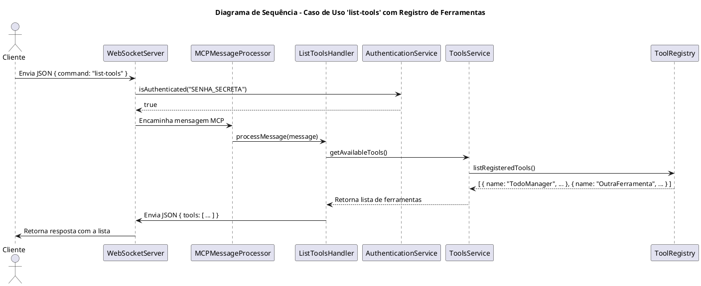
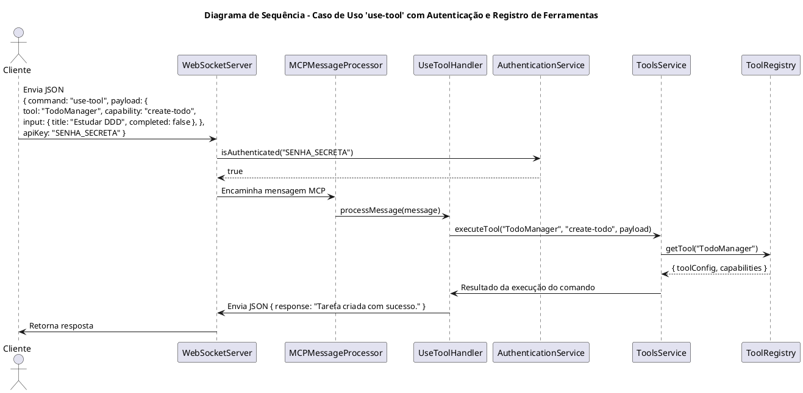
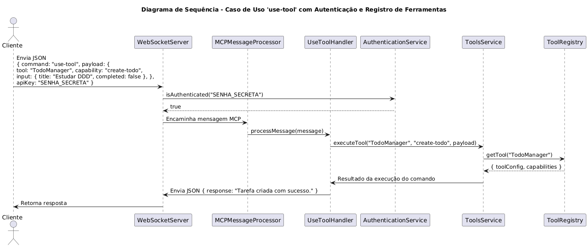

## 1. Diagrama de Sequência – Caso de Uso "list-tools" com Consulta ao Registro de Ferramentas

Este diagrama demonstra o fluxo para a listagem de ferramentas, onde não é necessário autenticar o usuário previamente. O **ListToolsHandler** chama o **ToolsService**, que por sua vez consulta o **ToolRegistry** para retornar todas as ferramentas registradas.

**Explicação:**

1. **Solicitação da Lista:**

   - O **Cliente** envia um comando JSON para solicitar a listagem de ferramentas, com o comando `list-tools`.

2. **Encaminhamento da Mensagem:**

   - O **WebSocketServer** direciona a mensagem ao **MCPMessageProcessor**, que identifica que o fluxo deve ser processado pelo **ListToolsHandler**.

3. **Consulta às Ferramentas Registradas:**

   - O **ListToolsHandler** solicita ao **ToolsService** a lista de ferramentas disponíveis.
   - O **ToolsService** contata o **ToolRegistry**, que retorna a lista de tools registrados (por exemplo, _TodoManager_ e outras, se existirem).

4. **Resposta ao Cliente:**
   - A lista é repassada pelo **ToolsService** para o **ListToolsHandler**, que envia a resposta de volta ao **Cliente** através do **WebSocketServer**.

---

## 2. Diagrama de Sequência – Caso de Uso "use-tool" com Autenticação e Registro de Ferramentas

Este diagrama ilustra o fluxo para a execução de um comando via **use-tool**, agora aplicado a um tool registrado (por exemplo, o _TodoManager_). Nele, o cliente envia os dados (incluindo o subcomando, como por exemplo `create-todo`) e o fluxo integra a validação da chave via **AuthenticationService**, a busca do tool via **ToolRegistry** (geralmente invocado pelo **ToolsService**) e a resposta final.

**Explicação:**

1. **Envio do Comando:**

   - O **Cliente** envia um comando JSON para executar um subcomando (por exemplo, `create-todo`) do tool _TodoManager_, incluindo o campo `apiKey` na carga.

2. **Encaminhamento e Processamento:**

   - O **WebSocketServer** repassa a mensagem para o **MCPMessageProcessor**, que identifica que o comando deverá ser tratado pelo **UseToolHandler**.

3. **Autenticação:**

   - O **UseToolHandler** invoca o **AuthenticationService** para validar a chave de API ("SENHA*SECRETA") de forma \_eager*.
   - Uma resposta positiva permite a continuidade do fluxo.

4. **Execução do Comando com Ferramenta Registrada:**

   - O **UseToolHandler** chama o **ToolsService** para executar o comando.
   - O **ToolsService** consulta o **ToolRegistry** (onde o tool _TodoManager_ foi previamente registrado com suas capacidades) e obtém a configuração e os schemas necessários para o subcomando.
   - Após a execução, o resultado é repassado de volta ao **UseToolHandler**.

5. **Resposta ao Cliente:**
   - O **UseToolHandler** envia a resposta (por exemplo, uma confirmação de que a tarefa foi criada) ao **WebSocketServer**, que por sua vez encaminha ao **Cliente**.

---

## Ferramentas

[PlantUML](https://plantuml.com)
